## 写在前面

>一直想搭一个自己的Blog，但是就这样拖到了现在，我能说一句是没(tai)时(lan)间(la)吗？断断续续掰呲这个博客有一小段时间了，想起来就弄一下，写这篇日志算是一个记录吧。
>
>如果你也正在打算做一个自己的博客，碰巧进来看到的话，希望对你有帮助。
>
>现在个人博客网站很多采用Hexo + Gitpage + NexT 或者 Jekyll搭建静态网页，然后部署到自己的域名网站上，还有的采用WordPress。我个人比较喜欢现在博客简洁的风格，所以我的博客是采用Hexo来搭建的。


[原文地址](yaoayaoa.cn)

## 关于Hexo部分


对于工具环境，我用的MacBook Pro，但是命令行的差别不大，所以使用Windows来搭建也不必担心。

<!-- more -->

### 注册Github账号

我们需要先将博客部署到GitHub上，所以需要一个GitHub账号，如果已经有请忽略，没有的话去[GitHub官网](https://github.com/)注册一个即可。

Github账号解决后，创建一个仓库。


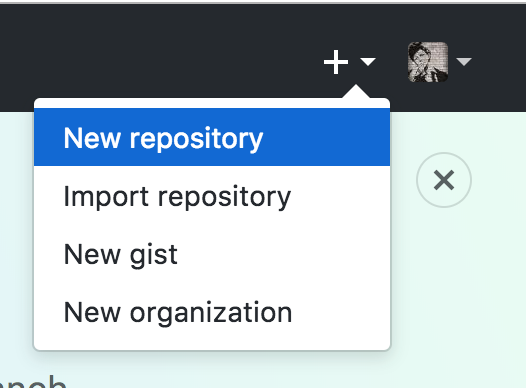


### 填写仓库名称

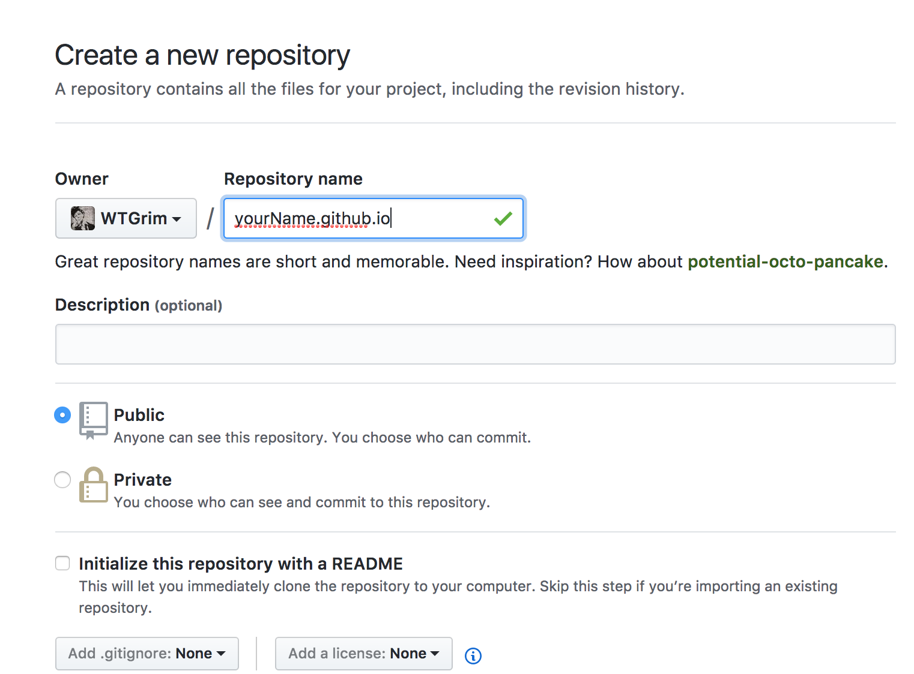

填写规则：

```
Github昵称.github.io
```

然后点击创建即可。


### 生成秘钥

在终端中输入：

```
ssh-keygen -t rsa -C "Github的注册邮箱地址"
```

然后一路`Enter`就好，待秘钥生成完毕，会得到两个文件**id_rsa**和**id_rsa.pub**。用带格式的记事本或者编辑器打开id_rsa.pub，Ctrl + a复制里面的所有内容，然后进入<https://github.com/settings/ssh>：

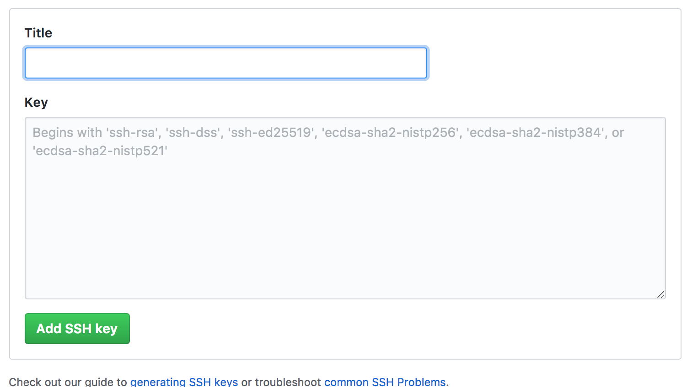

将复制的内容粘贴到Key的输入框，Title里面的内容可随意填写，点击`Add SSH key`按钮即可。


## 安装node.js

这里推荐Homebrew来安装node.js。


### Homebrew

[Homebrew](http://brew.sh/), Mac系统的包管理器，用于安装NodeJS和一些其他必需的工具软件。

```
/usr/bin/ruby -e "$(curl -fsSL https://raw.githubusercontent.com/Homebrew/install/master/install)"
```

译注：在Max OS X 10.11（El Capitan)版本中，homebrew在安装软件时可能会碰到`/usr/local`目录不可写的权限问题。可以使用下面的命令修复：

```
sudo chown -R `whoami` /usr/local
```

### Node

使用Homebrew来安装[Node.js](https://nodejs.org/).

```
brew install node
```

安装完node后建议设置npm镜像以加速后面的过程（或使用科学上网工具）。注意：不要使用cnpm！cnpm安装的模块路径比较奇怪，packager不能正常识别！

```
npm config set registry https://registry.npm.taobao.org --global
npm config set disturl https://npm.taobao.org/dist --global
```

### 安装git

```objective-c
npm install hexo-deployer-git --save
```


## 安装Hexo

在你电脑上方便放置Blog文件夹的地方，创建一个Blog文件夹(名字你随意啦，最好英文吧，职业病)。

然后在终端中

```
$ cd 到你创建的blog文件夹(可以将文件夹拖到此处就会自动生成路径)
```

下载安装hexo执行命令

```
$ npm install -g hexo-cli
```


### 初始化博客

在当前路径下直接输入

```
$ hexo init 
// node.js的命令，根据博客既定的dependencies配置安装所有的依赖包
$ npm install
```

执行完命令后，可以在创建的blog文件夹下看到如下文件

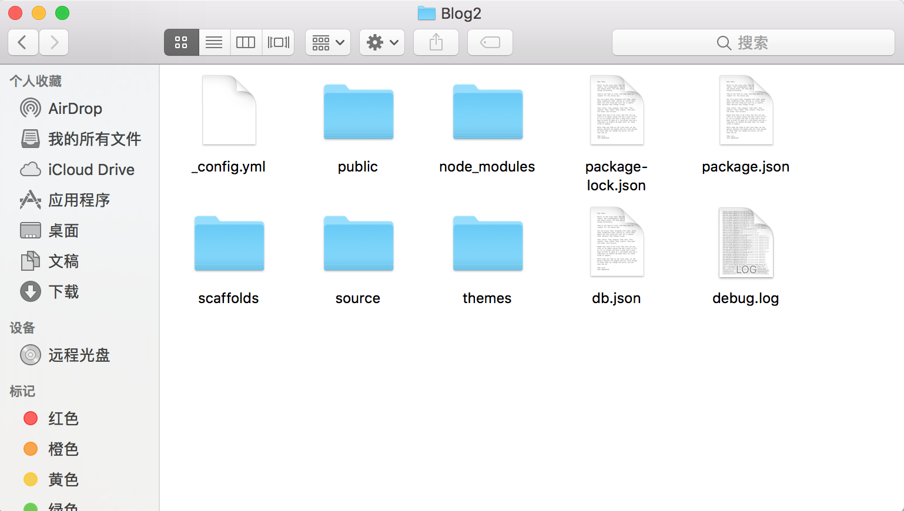


### 配置Hexo

在上面的文件夹下可以看到一个_config.yml的文件，它就是站点配置文件，用编辑器(如果有Xcode推荐Xcode)打开，如下

```
# Hexo Configuration
## Docs: https://hexo.io/docs/configuration.html
## Source: https://github.com/hexojs/hexo/

# Site
title: # The title of your website
subtitle: # The subtitle of your website
description: # The description of your website
author: # Your name
language: # The language of your website
timezone: 

# URL
## If your site is put in a subdirectory, set url as 'http://yoursite.com/child' and root as '/child/'
url: http://yoursite.com/child
root: /
permalink: :year/:month/:day/:title/
permalink_defaults:

# Directory
source_dir: source
public_dir: public
tag_dir: tags
archive_dir: archives
category_dir: categories
code_dir: downloads/code
i18n_dir: :lang
skip_render:

# Writing
new_post_name: :title.md # File name of new posts
default_layout: post
titlecase: false # Transform title into titlecase
external_link: true # Open external links in new tab
filename_case: 0
render_drafts: false
post_asset_folder: false
relative_link: false
future: true
highlight:
  enable: true
  line_number: true
  auto_detect: false
  tab_replace:

# Category & Tag
default_category: uncategorized
category_map:
tag_map:

# Date / Time format
## Hexo uses Moment.js to parse and display date
## You can customize the date format as defined in
## http://momentjs.com/docs/#/displaying/format/
date_format: YYYY-MM-DD
time_format: HH:mm:ss

# Pagination
## Set per_page to 0 to disable pagination
per_page: 10
pagination_dir: page

# Extensions
## Plugins: https://hexo.io/plugins/
## Themes: https://hexo.io/themes/
theme: landscape

# Deployment
## Docs: https://hexo.io/docs/deployment.html
deploy:
  type: 
```


不要看着这么多，其实用我们配置的地方比较少。（**所有输入的配置，需要在冒号后面留一个空格，切记**）

```
title: GRIM
subtitle: just do it
description: Wasn't looking for someone until you.
author: GRIM
language: zh-Hans
timezone: Asia/Shanghai
avatar: /images/blogAvatar.png
```

关于头像avatar，有两种方式，一种是网络图片，在后面放置头像的URL即可，另外一种是本地图片，将图片放置到next主题文件夹themes/next/source/images，然后如上图输入绝对路径即可，关于next主题现在我们还没到那一步，后面我们会讲到，所以现在放置网络图片的URL即可。


### 配置个人域名

```
url: https://github昵称.github.io
```

ps:如果后面购买了域名网站，将这里改为你的个人域名网站即可。

对于root（根目录）、permalink（永久链接）、permalink_defaults（默认永久链接）等其他信息保持默认。


### 配置部署deploy

```
  type: git
  repo: https://github.com/WTGrim/WTGrim.github.io.git
  branch: master
```

其中repo，是放置Blog的仓库地址，如下可得复制到这里即可。

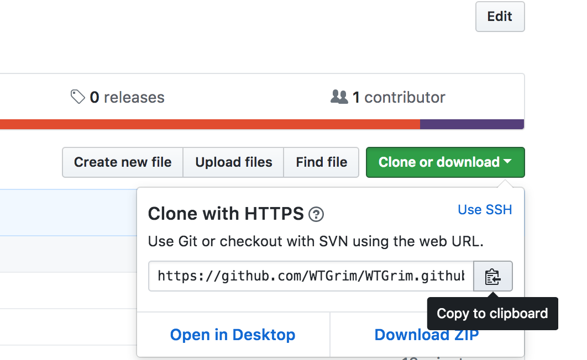


### 发表文章

```
hexo new "文章标题"
```

然后可以在本地博客文件夹`source`/`_post`文件夹下看到新建的markdown文件。

用支持markdown语法的编辑器编辑这边文章

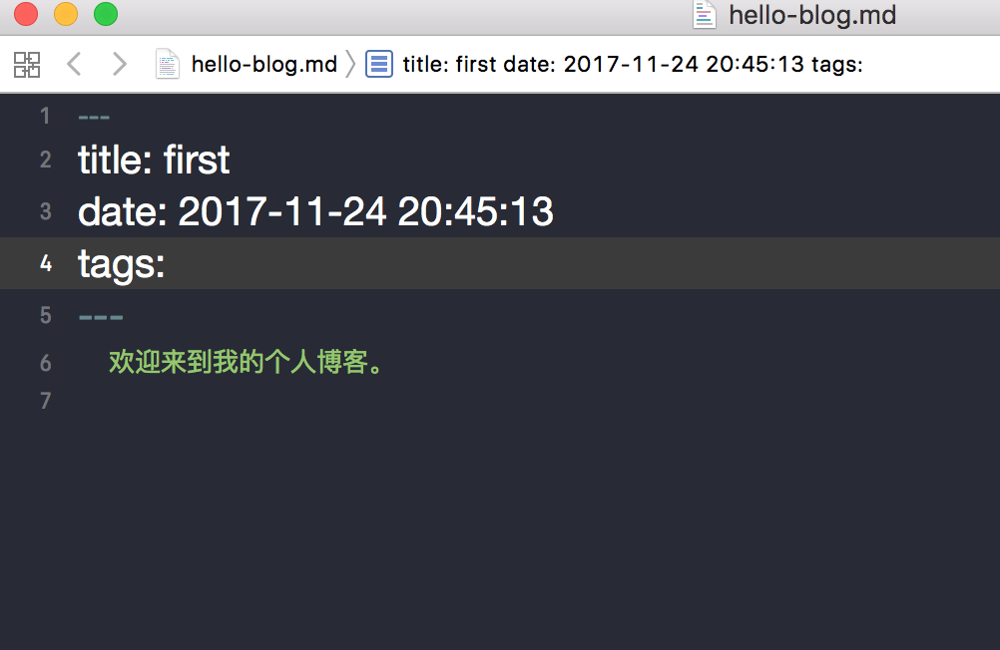


编辑保存后，接下来进行本地发布，终端进到博客文件，执行命令

```
$ hexo server
```

完成后可以看到提示在http://localhost:4000/ 打开浏览，打开浏览器输入网址即可看到效果，这里我就不截图了（因为懒），大致是一个发光的地球哇，上面有你的昵称。


这个时候，这个页面只能在本机能看到，怎么让别人也能访问我们的博客呢？

那么我们需要将博客部署到Github上，只需要在当前目录下，终端中执行命令

```
$ hexo generate
$ hexo deploy
```

然后在浏览器中输入

```
你的昵称.github.io
```


## 更换主题

Ps:下班啦 下次更新!

更新！

由于现在的界面可能觉得，嗯界面不太好看，那么就需要更换主题，我们用NexT来更换主题。

### 下载NexT主题

在终端中，cd到博客的根目录下，执行命令：

```
$ git clone https://github.com/iissnan/hexo-theme-next themes/next
```

在 Hexo 中有两份主要的配置文件，其名称都是 _config.yml 。其中，一份位于站点根目录下，主要包含 Hexo 本身的配置；另一份位于主题目录下，这份配置由主题作者提供，主要用于配置主题相关的选项。
我们约定，将前者称为 **站点配置文件**，后者称为 **主题配置文件**

### 启用 NexT 主题

打开 **站点配置**文件 ，找到 theme 字段，并将其值更改为 next 。
NexT 主题安装完成。下一步我们将验证主题是否正确启用，在切换主题之后、验证之前，我们最好使用 `hexo clean` 来清除 Hexo 的缓存。

执行部署命令

```
$ hexo clean
$ hexo g
$ hexo d
```

注意：由于部署需要一定时间，所以每次部署等一小段时间才能看到效果（下同）。

在浏览器中输入``你的昵称.github.io``即可观察到muse主题效果

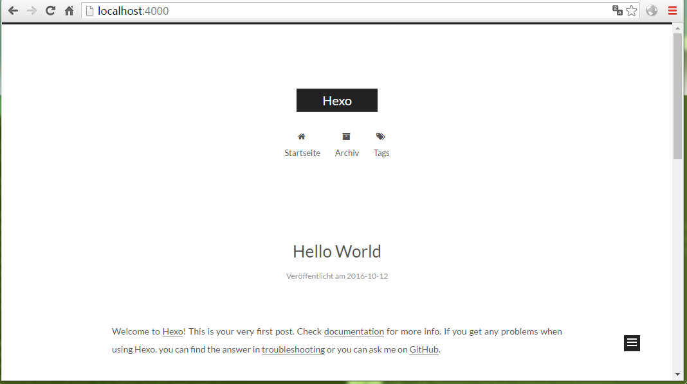


当然，也可切换主题，有四种主题可选

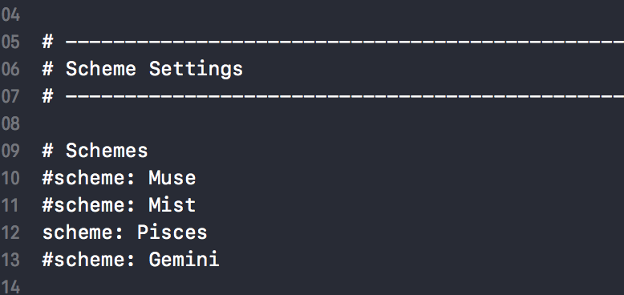


### 添加背景动画

1. 将 [particle.js](https://github.com/Neveryu/Neveryu.github.io/blob/master/js/src/particle.js) 文件添加到 \themes\next\source\js\src 文件目录下。

2. 找到 ``\themes\next\layout\_layout.swing`` 文件，**在文件的后面，</body>标签之前 **添加以下代码：

   ```
   <!-- 背景动画 -->
   <script type="text/javascript" src="/js/src/particle.js"></script>
   ```

注意：这个背景动画占用资源挺高的，每次打开博客，我的机器风扇就转的呼呼的，看自己需要添加吧。

## 同步Hexo搭建的博客

这点算是比较重要的，因为初次搭建好Blog，Hexo相关的配置都只存在于你的这台电脑上，如果你换电脑了或者搭建用的公司的电脑，那么回家你在自己的电脑上就拿不到之前已经配置好的Hexo，从而不能继续进行相关的配置。

那么接下来要做的就是将我们已配置好的Hexo同步到之前我们创建的Github的仓库的分支上。

终端中cd到博客的根目录下

```
cd 博客路径
```

这样就讲Hexo相关配置上传到了仓库的分支上，那么在另外一台设备上可以这样做

```
// 克隆文件到本地
git clone -b 分支名 https://github.com/用户名/仓库名.git
```

将Hexo配置下载下来，继续相关的配置或者写文章，完成后也要提交你的配置

```
// 添加源文件
git add .
// git提交
git commit -m ""
// 先拉原来Github分支上的源文件到本地，进行合并
git pull origin 分支名
// 比较解决前后版本冲突后，push源文件到Github的分支
git push origin 分支名
```

这样就实现了自己Blog的Hexo同步。

```
// 初始化仓库
git init
// 添加仓库地址
git remote add origin https://github.com/用户名/仓库名.git
// 新建分支并切换到新建的分支
git checkout -b 分支名
// 添加所有本地文件到git
git add .
// git提交描述
git commit -m ""
// 推送到hexo分支
git push origin 分支名
```


## 绑定个人域名

如果觉得现在的``你的昵称.github.io``并不是很炫酷，那么你可以通过购买域名，将自己的Blog部署上去。

可以在阿里云上购买域名[阿里云域名页面](https://wanwang.aliyun.com/?spm=5176.8142029.735711.56.3836dbccCvcics)，推荐.com .cn的域名，价格相应贵一点，可是看起来顺眼啊，什么.xyz

.top总感觉怪怪的，看个人喜好吧。

### 域名解析

购买域名后，我们登录进入阿里云官网的[控制台](https://home.console.aliyun.com/?spm=5176.8142029.388261.21.ZtVm97)，在域名列表中可查看自己购买的域名

点击列表中对应的域名所在列的**解析**，进入解析界面

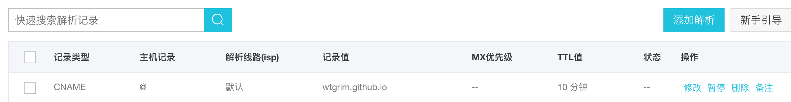


点击**添加解析**按钮，三个输入格输入：**CNAME**、**@**、**Github博客域名**。选择保存完成个人域名向个人博客的映射。添加解析后，在浏览器输入我们新注册的域名

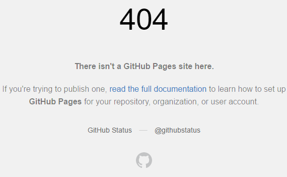


可是出现了**404**错误，说明域名已经成功映射到了Github网站，但是它找不到博客的位置，所以我们需要实现个人博客向个人域名的映射，进入Github博客的仓库

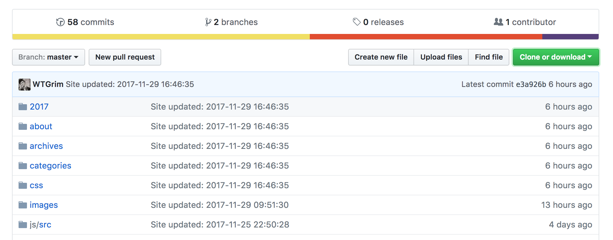


点击上图上方偏右的**Create new file**按钮，创建一个文件：

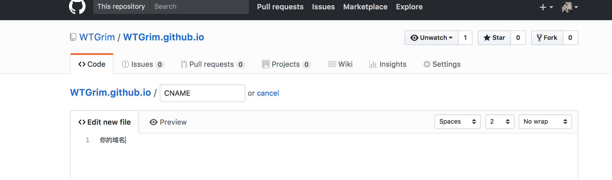


文件名为**CNAME**(注意：没有扩展名)，文件内容为**个人域名**(注意：没有**http://**，没有**www**)，然后选择下方的**Commit new file**按钮。然后在浏览器端重新输入我们的域名，可以看到域名绑定成功。


### 问题

当在本地使用`hexo d`命令再一次部署博客时，会发现博客网页的**css样式丢失**或是**404**错误，这是因为本地的博客工程里面还没有CNAME，当我们重新部署后，远程的博客工程会和本地保持同步，将CNAME文件删除，所以需要在本地添加CNAME文件。

这里需要注意的是：CNAME文件添加的目录是在根目录下的source文件夹，而不是.deploy_git文件夹，完成添加后重新部署，博客网站恢复正常。在Mac上创建的文本编辑默认是.rtf为扩展名的，还是在Windows上创建了一个.txt，然后输入域名保存后，将扩展名删掉完成的。


## 添加分类、评论、打赏、RSS功能

进行到这里，现在的博客看起来还比较单一，需要我们自己往博客上添加我们想要的模块。


### 添加分类模块

例如，添加一个分类模块，在博客文件目录下执行

```
hexo new page "categories"
```

执行命令完成后，会在themes/source下创建一个名为categories的文件夹，打开里面的index.md文件，

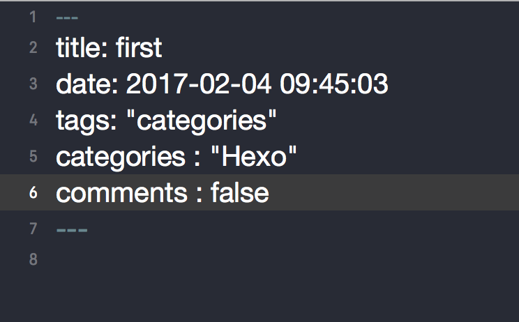

同理，你可以依照上述流程创建，tags（标签）和about（关于）的模块。


在**主题文件**下，设置menu和相应的图标，关于图标你可以使用[Font Awesome](http://fontawesome.io/icons/)，直接找到相应的名字就可以。


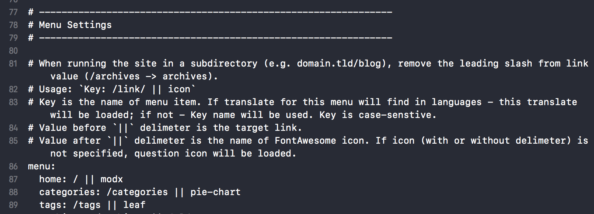

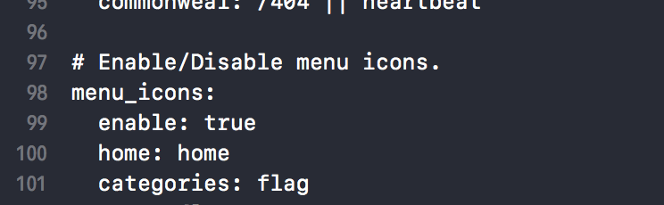

重新就行部署，你可以发现分类页面、图标相应的变化。

以此类推添加你想要的模块。注意，你可能需要到theme/next/languages中的zh-hans中去配置你需要的文字描述。


### 添加评论

其实现在最新版的NexT已经集成了很多第三方评论服务。继多说，网易云跟帖相继停止自己的服务外，现在算是挺难找到一个不需要VPN、UI又好看以及集成较多登录方式的评论了，个人觉得Github的Gitment算是比较好的选择，还有一个是来必力，但是需要翻墙，评论速度就不敢恭维了。

这里我提供NexT官方[集成评论](http://theme-next.iissnan.com/third-party-services.html)的网址，集成也比较简单方便，支持DISQUS、来必力（都需要科学上网），按自己的喜好来吧。

主要说一下集成**Gitment**评论：

Gitment是使用的GitHub Issues作为评论系统，在接入Gitment前，需要获得GitHub的授权，获得相应的客户端id和客户端私钥，以备站点使用。

[OAuth application注册接入](http://colabug.com/goto/aHR0cHM6Ly9naXRodWIuY29tL3NldHRpbmdzL2FwcGxpY2F0aW9ucy9uZXc=)


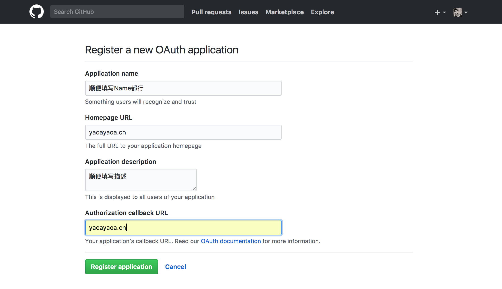

从而获取到获取Client ID和Client Secret。然后打开**主题配置**文件，进行相应填写后，将enable修改为true，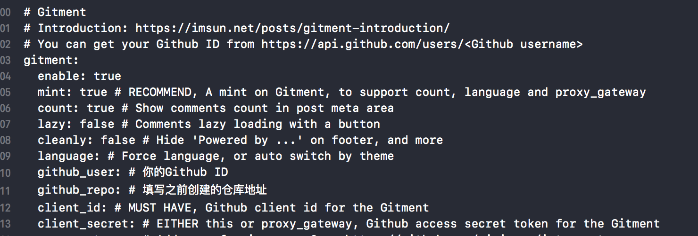


重写部署，就可以看到添加评论后的效果:


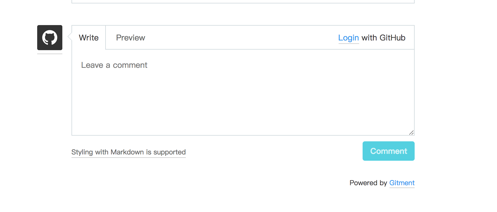

### 打赏功能

打赏功能呢，是每个创作者创作动力，请暂且允许我这么说，但是基本不会有人打赏呐。但是可以作为一个技术功能来添加到自己的博客也未尝不可。

NexT支持微信和支付宝二维码打赏的功能，只需要将自己微信和支付宝收款的二维码的图保存下来就可以了（也可以设置对应的金额，就看你的人品会不会有人买单呐），具体操作这里就不做阐述了，实在有问题的话可以自行百度一下。

将保存下来的二维码进行相应命名后放到themes/next/source/images文件夹下，然后配置主题文件如下即可：

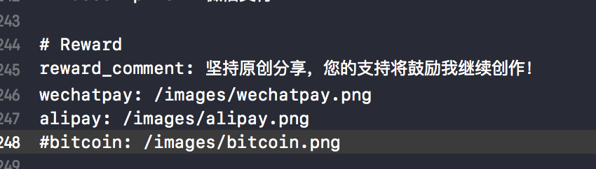

然后重新部署，等一小会儿到自己的博客文章底部可看到效果。

```
$ hexo clean
$ hexo g
$ hexo d
```


### 添加RSS

**安装 [hexo-generator-feed](https://github.com/hexojs/hexo-generator-feed) 插件**

- RSS需要有一个Feed链接，而这个链接需要靠hexo-generator-feed插件来生成，所以第一步需要添加插件，在Hexo根目录执行安装指令：

  ```
  npm install hexo-generator-feed --save
  ```

- **配置feed信息**
  在**站点配置文件**中追加如下图所示的信息：

  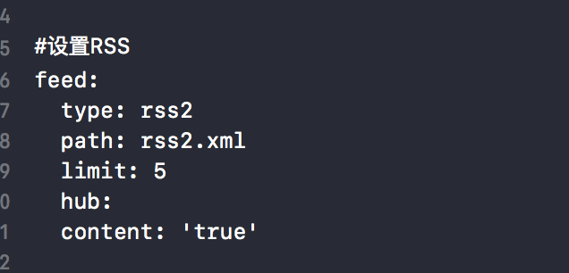

重新部署后可看到这样的效果:

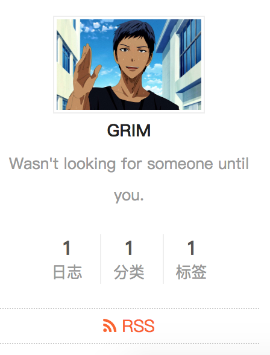


## 写在最后

到此，相信你已经搭建了一个自己简单的博客，后续空闲我会更新如何打造一个更加炫酷的博客，包括文章中引用图片的问题、添加进度条、添加音乐、添加阅读数据统计、添加宠物、文章中添加版权信息、打赏文字不闪动、添加热度、添加文章加密访问等等功能。

休息休息，祝玩得愉快！