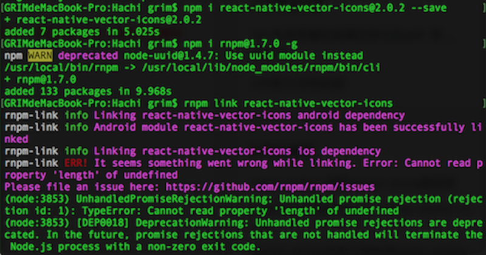
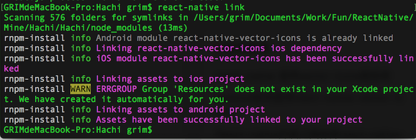
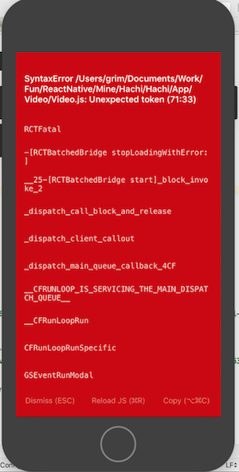
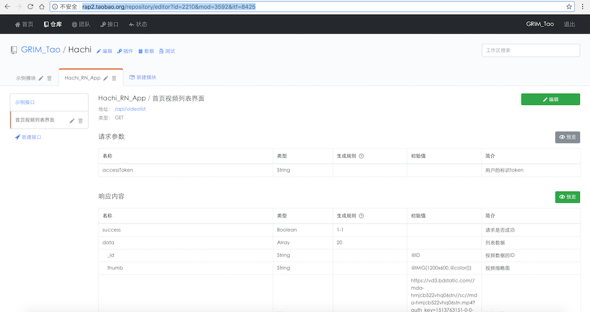
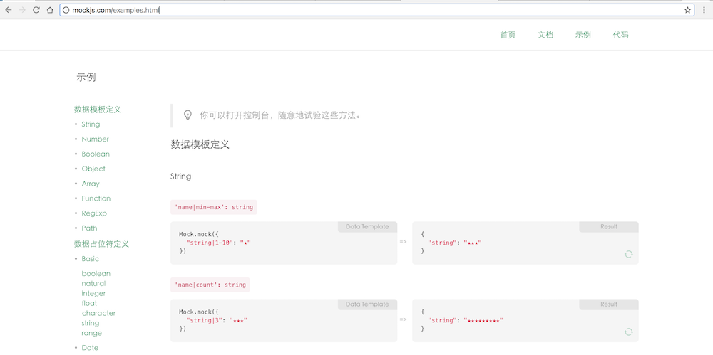
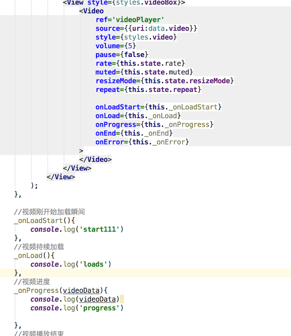

> React Native让开发者使用JavaScript和React编写应用，利用相同的核心代码就可以创建基于Web、iOS和Android平台的原生应用。Facebook在2015.3.26 F8大会上开源了React Native，实现了Web和iOS平台，并且在2015.9.15把JavaScript技术应用到了Android平台上，自此React Native已经支持当前主流平台。


## 关于React Native环境配置

在这里，我们就不介绍有关React Native环境配置了，可以去[React Native官网](https://facebook.github.io/react-native/)得到相应的帮助，或者国内关于[React Native中文网](http://reactnative.cn/docs/0.50/getting-started.html)查看相关内容，有MacOS、Linux、Windows对应iOS和Android平台的相关配置，相信这些完全能满足你的需求。

<!--more-->

PS：*init命令默认会创建最新的版本，而目前最新的0.45及以上版本需要下载boost库编译。此库体积庞大，在国内即便翻墙也很难下载成功，导致很多人**无法正常运行iOS项目**，中文网在论坛中提供了这些库的[国内下载链接](http://bbs.reactnative.cn/topic/4301/)。如果你嫌麻烦，又没有对新版本的需求，那么可以暂时创建`0.44.3`的版本。*

> 提示：你可以使用`--version`参数（注意是`两`个杠）创建指定版本的项目。例如`react-native init MyApp --version 0.44.3`。注意版本号必须精确到两个小数点。

创建个人项目完成后，可以使用命令号工具执行``react-native run-ios``或者``react-native run-androi``运行项目，这里就不再赘述了。


## 项目实践

之前在网上看到有人用React Native仿写了美团App首页，在自己的尝试后也写了一个相应的React Native项目。那个小项目算是我初识React Native。惊叹于React Native的"Learn once, Write anywhere"的同时，也发现里面的东西挺多的，需要一定的前端基础，例如JSX语法、CSS-layout、ES6或ES5编程语言、flexbox布局等等。

现在因为自己未来的一些个人打算，重拾React Native，希望能够在里面更深层次的探索，同时结合node.js后端的知识，重新写一个项目，从而也提高一下自己的技术栈和技术沉淀。

项目主要涉及：

* 启动画面（配置文件）

* 过渡画面（过渡倒计时）

* 轮播图（轮播组件）

* 注册页面（发送验证码和倒计时）

* 视频列表（封装网络请求组件Fetch，视频点赞功能和滑动预加载）

* 视频详情页（视频播放，评论浮层，评论功能）

* 创作主页（录制视频、预览效果、发布视频到服务端、服务端视频分离、合并进度条显示、删除视频）

* 账户主页（编辑资料浮层、修改资料、本地数据同步）

  ​


### 初始化项目

#### link  react-native-vector-icons 库报错

ICONS是可以直接使用图片名, 就能加载图片的三方,使用很方便, 你不需要在工程文件夹里塞各种图片, 节省很多空间。但是在加入时遇到第一个坑，安装react-native-vector-icons和rnpm完成后，将react-native-vector-icons链接到项目，使用rnpm link react-native-vector-icons报错，iOS链接失败。



后面没办法，后面找到解决办法就是使用react-native link简单粗暴地解决。




不想写了 待更新！😂

紧接着出现了一个让我想吐的坑，在链接react-native-vector-icons后，使用

```
import Icon from 'react-native-vector-icons/Ionicons';
```

在需要的地方使用Icon的文字图片

```
                        <Icon
                            name:'ios-play'
                            size={28}
                            style={styles.play}
                        />
```

但是出现了一个万年错误：




[官网](https://www.npmjs.com/package/react-native-vector-icons)介绍说使用react-native link可能会出现未知错误，所以选择换一个方式，在node_modules中react-native-vector-icons下面的fonts文件夹拷贝到Xcode下面，在Info.plist中加入外部应用字体描述，结果依然走不通。（我真是炸了）

这个问题真是困扰几天 ，放弃。后面才发现使用``react-native link``后面必须加上要链接的组件名，否则就会不成功，即使用``react-native link react-native-vector-icons``。


### 后台模拟数据

在项目初期，往往会构造一些假的数据，可以自己写json文件或者plist等等，项目后面会用node.js构造项目的服务器。这里我借助淘宝的rap工具来模拟假的数据。现在推荐使用[rap2](http://rap2.taobao.org/)，界面十分简洁，是我喜欢的风格。


里面在构建数据结构的时候会用到生成规则，使用mockjs语法能轻松满足数据需求，可以去[mockjs](mockjs.com)官网获得相应的语法帮助。





### 视频播放

在项目详情页，进入后主动开启视频播放，在项目中采用组件``react-native-video``，使用方法可见[react-native-video](https://github.com/react-native-community/react-native-video)。


在视频阶段转角遭遇一坑，使用上面的视频播放组件，虽然能调用视频开始加载的方法，也就是onLoadStart，但是没有后续执行，以至于视频一直在停留在自己写的菊花阶段。纠结了两天未果，😖。


